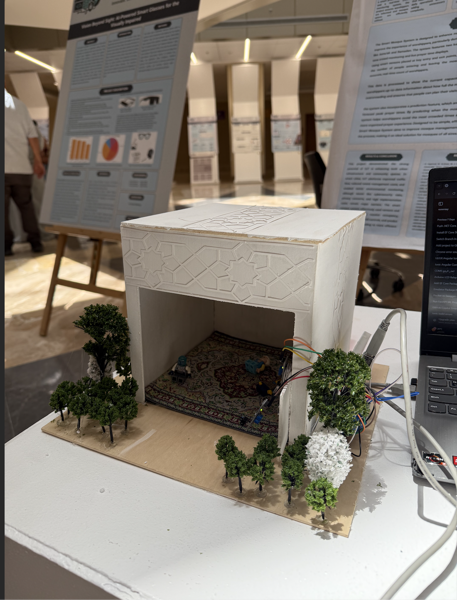
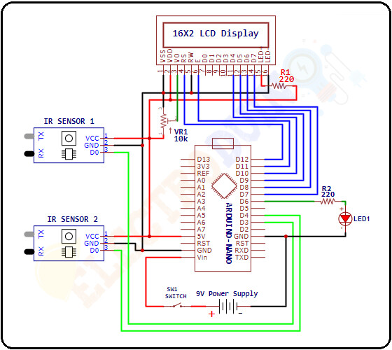

# 🕌 Smart Mosque Occupancy Monitoring System (Arduino + IR Sensors)

A **real-time occupancy monitoring system** that counts how many people are inside a mosque (or any venue) using **two IR sensors**:  
- **Entry sensor** → increments count  
- **Exit sensor** → decrements count  

It also includes **simulated predictive analytics** for peak prayer times and **UI/UX prototypes** showing how the system would look as a dashboard/app. (This matches the project concept described in the uploaded project summary.) :contentReference[oaicite:0]{index=0}

---
## 🧰 Components Used
- Arduino (Uno / Nano / Mega — Arduino-friendly code)
- 2 × Infrared (IR) sensors
- Jumper wires
- Relay module (optional, for automation/alerts)
- (Optional) Buzzer / LED / LCD / OLED (if you want live display)

## 🔌 Wiring (Typical)
> Pin numbers can be changed in the Arduino code if needed.

### 🟢 IR Sensor – Entrance
| IR Sensor Pin | Arduino Pin |
|--------------|-------------|
| VCC          | 5V          |
| GND          | GND         |
| OUT          | D2          |

### 🔵 IR Sensor – Exit
| IR Sensor Pin | Arduino Pin |
|--------------|-------------|
| VCC          | 5V          |
| GND          | GND         |
| OUT          | D3          |

### 🔴 Relay Module (Optional)
| Relay Pin | Arduino Pin |
|----------|-------------|
| VCC      | 5V          |
| GND      | GND         |
| IN       | D8          |

---

## 🔌 How It Works
1. **IR Sensor at Entrance** detects a person crossing → `count++`
2. **IR Sensor at Exit** detects a person crossing → `count--`
3. Count is displayed via **Serial Monitor** (or optional LCD/OLED)
4. If count reaches a threshold (capacity), **relay can activate** (optional)
5. A simple script/notebook can generate **predicted peak times** using past counts (simulated)

---
## ▶️ How to Run the Arduino Code

1. Open `occupancy_counter.ino` in **Arduino IDE**
2. Select the correct **Board** and **Port**
3. Upload the code to the Arduino
4. Open **Serial Monitor**
5. Walk in front of:
   - Entrance sensor → count increases
   - Exit sensor → count decreases
---
## 🖼 UI Prototype Overview

